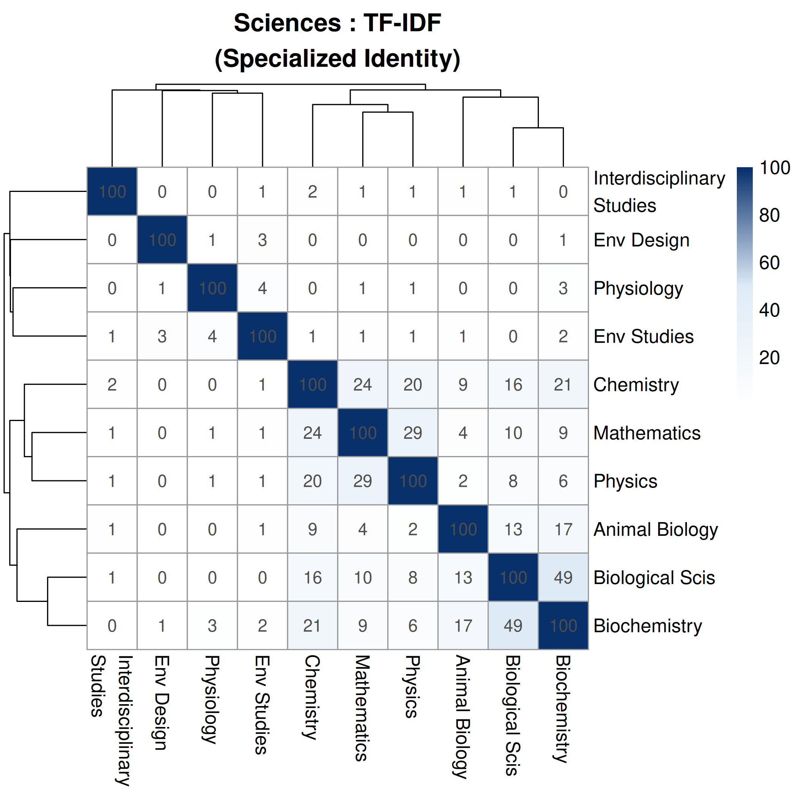
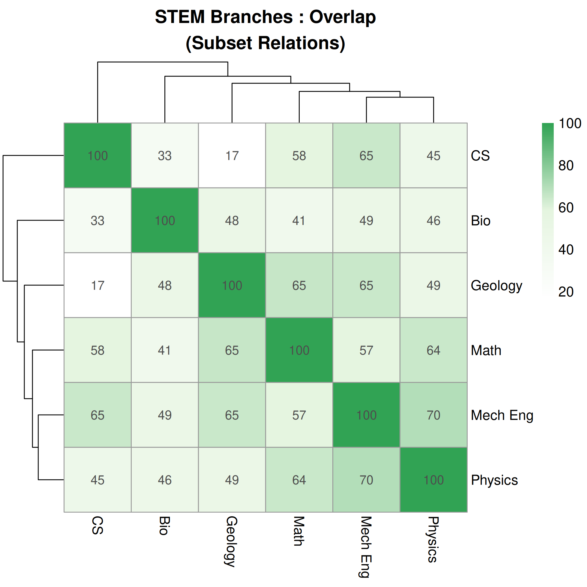

#+title: WIP: Vectorized Interdisciplinary Overlap between STEM Domains using the MIDFIELD Dataset
#+DATE: \today
#+options: toc:nil author:nil

#+LATEX_CLASS: article
#+LATEX_CLASS_OPTIONS: [12pt]
#+LATEX_HEADER: \usepackage[margin=1in]{geometry}
#+LATEX_HEADER: \usepackage{times}
#+LATEX_HEADER: \usepackage[parfill]{parskip}
#+LATEX_HEADER: \usepackage{amsmath}
#+LATEX_HEADER: \usepackage{graphicx}
#+LATEX_HEADER: \usepackage{wrapfig}
#+LATEX_HEADER: \usepackage{needspace}
#+LATEX_HEADER: \usepackage{titlesec}
#+LATEX_HEADER: \titleformat*{\section}{\normalsize\bfseries}
#+LATEX_HEADER: \titleformat*{\subsection}{\normalsize\bfseries}
#+LATEX_HEADER: \usepackage{titling}
#+LATEX_HEADER: \pretitle{\begin{center}\large\bfseries}
#+LATEX_HEADER: \posttitle{\end{center}}
#+LATEX_HEADER: \PassOptionsToPackage{numbers,super}{natbib}
#+BIBLIOGRAPHY: bibliography.bib
#+cite_export: natbib unsrtnat

#+begin_abstract
This work in progress applies multiple similarity metrics to course enrollment vectors derived from the MIDFIELD dataset to characterize relationships between undergraduate STEM programs. We employ five complementary measures---Jaccard, TF-IDF Cosine, Overlap Coefficient, PMI, and Kulczynski---to distinguish curricular width, specialized identity, subset relations, signature course bonds, and mutual resemblance. Three relationship categories emerge from the metric analysis: /nested/ relationships, where one program's coursework is largely contained within another; /parallel/ relationships, where programs share a common curricular base but diverge in specialization; and /convergent/ relationships, where programs share both general and specialized content at high levels. Applied to computing, engineering, science, and cross-domain STEM groupings, the approach surfaces non-obvious pairings such as Aerospace and Industrial Engineering---a convergent pair with the highest specialized technical similarity (~45% TF-IDF Cosine) in the engineering group despite occupying different traditional sub-disciplines. We address the research question: /What types of curricular relationships have emerged between undergraduate STEM programs as evidenced by student enrollment patterns?/ Preliminary results and implications for curriculum design are discussed.
#+end_abstract

/Keywords:/ Interdisciplinary Education, Curriculum Analysis, MIDFIELD, Similarity Metrics

* Introduction

** Study Motivation

Students often have a level of agency in the courses they take on their paths to graduation, opting to take courses that may not be housed in their declared major's department. Such cross-departmental enrollment indicates that students acquire knowledge, skills, or attitudes (KSAs) from several disciplines and are, to some degree, interdisciplinary in their education. Courses frequently chosen by students in a given domain indicate a trend that we interpret as overlap between programs.

Interdisciplinary studies integrate concepts, theories, and methods from multiple disciplines [cite:@klein1990interdisciplinarity]. In interdisciplinary majors, there is a deliberate effort to create a new perspective or approach that is not limited to any single discipline, resulting in a deeper understanding of complex issues. Interdisciplinary majors create space for solutions that would be impossible within the confines of a single discipline. While multidisciplinary approaches also draw on multiple fields, interdisciplinary programs combine tools and methods from distinct disciplines into an integrated whole [cite:@klein1990interdisciplinarity].

Interdisciplinary programs can make STEM more attractive to students with marginalized identities who seek to bridge the gap between their lived experiences and technical fundamentals [cite:@marquardt2023engaging]. Franco et al. demonstrated that interdisciplinary quantitative initiatives can broaden participation in data-intensive fields [cite:@franco2020enhancing]. Identifying the courses and academic choices that facilitate cross-domain applicability is therefore both a curricular design concern and an equity concern.

We build on this foundation with the research question: /What types of curricular relationships have emerged between undergraduate STEM programs as evidenced by student enrollment patterns?/

** Application Spaces

This work analyzes undergraduate navigation through STEM domains using the Multiple-Institution Database for Investigating Engineering Longitudinal Development (MIDFIELD) [cite:@lord2022midfield]. We identify relationships between STEM degrees and classify them using three categories that emerge from the metric analysis:

- A *nested* relationship exists when the Overlap Coefficient between two programs is high while the Jaccard index is comparatively low, indicating that the smaller program functions as a specialized subset of the larger one. Information Technology and Computer Science exemplify this pattern: ~80% of IT coursework overlaps with CS, but their Jaccard index is only ~8.5% because CS covers far more ground.
- A *parallel* relationship exists when two programs share a substantial common base (high Jaccard or Kulczynski) but diverge in their specialized content (low TF-IDF Cosine). Most engineering sub-disciplines exhibit this pattern---for example, Electrical Engineering and Civil Engineering share a high proportion of their total coursework through the general engineering core, yet their TF-IDF similarity is very low because their specialized courses are distinct.
- A *convergent* relationship exists when two programs score high across all metrics---sharing both general coursework and specialized technical content---suggesting deep curricular alignment that may not be reflected in departmental organization. Aerospace Engineering and Industrial Engineering exemplify this: they produce the highest or near-highest similarity in the engineering group on every metric (TF-IDF ~45%, Jaccard ~47%, Overlap ~79%).

We use student enrollment in courses as a proxy to determine what fields students invest their efforts into and what they see as relevant for their career paths. We acknowledge that enrollment patterns reflect not only student interest but also degree requirements, prerequisite structures, and scheduling constraints. Our analysis therefore identifies /curricular overlap/---the extent to which student paths through programs share common coursework---rather than measuring interdisciplinary integration of knowledge per se. Where patterns exceed what degree requirements alone would predict, they may indicate genuine student interest in cross-domain study.

At the student level, this analysis informs academic advisors about which courses are likely to interest students seeking cross-domain exploration. At the department level, these relationships can help curriculum design committees identify where courses may succeed when hosted in other departments or where undocumented collaboration already exists. At the university level, these relationships can support the case for new interdisciplinary programs. If an institution has a pairing of domains with high course overlap, that overlap indicates existing demand for collaborative curriculum development.

** Background

Several STEM domains have been historically interdisciplinary. The computing domain has created new interdisciplinary programs as it engages with other knowledge branches such as human-centered computing and bioinformatics [cite:@denning2019computational]. These specialized programs offer a targeted approach to solving complex issues and act as a point of attraction for students to enroll in one university or department over another. The curricula of these interdisciplinary programs often include courses from their broader source fields. For example, a bioinformatics curriculum draws courses from both computer science and biology departments, and its coursework may be largely nested within either parent field's catalog. Specialized courses are also often created in the narrower field to meet the needs of interdisciplinary students. Many engineering programs include a general engineering component that gives a shared set of KSAs to all engineering students, creating parallel relationships where programs share a common base but diverge in specialization. Lord et al. have demonstrated the value of MIDFIELD for longitudinal studies of engineering student trajectories [cite:@lord2022midfield], and recent work in curricular analytics has shown the potential of quantitative approaches to curriculum evaluation [cite:@heileman2018curricular]. Our work extends these resources to cross-domain curricular analysis. Overall trends that emerge from considering the relationships between STEM domains as units of analysis can inform several levels of our education system to better support student academic agency and build interdisciplinary collaboration.

** Need for Convergence

Students develop the KSAs that represent their chosen domain as they progress through their coursework. Upon attaining a degree, graduates are expected to be prepared to contribute to real-world problem solving using these KSAs. The National Science Foundation has identified several grand challenges of our generation that require complex solutions guided by contributions from many fields. The NSF proposed growing convergence research as one of the top 10 BIG Ideas to address today's grand challenges [cite:@nsf2016bigideas]: the nation's grand challenges "will not be solved by one discipline alone" and instead require merging ideas, approaches, and technologies from widely diverse fields of knowledge to stimulate innovation and discovery. To prepare our students to take on these grand challenges, we must evaluate curriculum development to facilitate interdisciplinary studies. In our analysis below, we use the term "convergent" to describe a specific metric pattern where two programs share both general and specialized content at high levels. This is related to but distinct from the NSF's use of "convergence" to describe the merging of disciplinary approaches; convergent programs, as we define them, may be natural sites for the kind of convergence research the NSF envisions.

* Methodology

We use the MIDFIELD dataset [cite:@lord2022midfield] to collect records of courses that students were enrolled in during their education. Student paths to graduation are analyzed to determine curricular overlap between STEM domains. We extend our prior work that relied on binary course presence (enabling only Jaccard indices) by incorporating course frequency data, which enables a suite of complementary similarity metrics that each reveal a different facet of the relationship between programs.

** Data Source

The MIDFIELD dataset provides academic records of over 98,000 students from eighteen universities in the USA going back several decades [cite:@lord2022midfield]. We filter to data from 2000 onward to address the potential overrepresentation of older degree curricula and to better engage with curricula that are likely to represent a contemporary student's experience.

** Data Analysis

For each CIP code (Classification of Instructional Programs [cite:@nces2020cip]) in the MIDFIELD dataset, a set of courses is identified that any student who completed that degree took while progressing toward graduation. These sets include every course students took: general education courses, courses in and out of their declared major, courses that were begun but not completed, and courses that were both required and elective. Each course set is then augmented with the frequency of each course's presence in the dataset to create a vector. These vectors represent the domains in a many-dimensional space that enables the metrics interpreted in the next section. By incorporating course frequency rather than binary presence alone, we can apply multiple similarity metrics to the same vectorized data, enabling distinctions among subset containment, specialized identity, and statistically surprising co-enrollment that a single metric cannot capture.

** Metric Selection Rationale

A single similarity metric cannot distinguish between programs that share a broad general-education base and programs that share specialized technical content. We select metrics that each address a specific analytical limitation, as summarized below. Together, the suite separates curricular width from specialized identity, detects subset containment, and identifies statistically surprising co-enrollment bonds.

*** Jaccard Index (Curricular Width)

The Jaccard index [cite:@jaccard1912distribution] serves as our baseline. It measures the proportion of courses shared across the union of two programs' course sets. Because it treats every course taken by even one student as a set member, it can be diluted by rare electives, often resulting in lower scores for very large or diverse programs. It answers: /How much total curricular territory do two programs share?/

$$J(A, B) = \frac{|A \cap B|}{|A \cup B|}$$

*** TF-IDF Cosine (Specialized Identity)

Where Jaccard treats all courses equally, TF-IDF [cite:@sparckjones1972statistical;@salton1988term] weights courses by their specificity. A course like /Calculus I/ (taken by many majors) gets low weight, while /Advanced Microcontrollers/ (unique to a few) gets high weight. The cosine of the resulting TF-IDF vectors measures whether two programs share identity-defining coursework rather than generic prerequisites. This metric is resistant to differences in program size because it uses normalized frequencies. It answers: /Do two programs share the specialized courses that define their identities?/

$$\text{Cosine Similarity} = \frac{\mathbf{v}_A \cdot \mathbf{v}_B}{\|\mathbf{v}_A\| \|\mathbf{v}_B\|}$$

*** Overlap Coefficient (Subset Detection)

The Overlap Coefficient [cite:@szymkiewicz1934contribution;@simpson1960faunal] divides the intersection size by the size of the smaller set. A high Overlap Coefficient paired with a low Jaccard index is the signature of a nested relationship: the smaller program's coursework is largely contained within the larger one. For example, if Software Engineering students take almost everything Computer Science students take, but CS students have a much broader elective set, the Overlap Coefficient remains high while the Jaccard score drops. It answers: /Is one program's curriculum largely a subset of another's?/

$$\text{Overlap}(A, B) = \frac{|A \cap B|}{\min(|A|, |B|)}$$

*** PMI Similarity (Signature Bonds)

Pointwise Mutual Information [cite:@church1990word] measures whether a course-major pairing occurs more often than would be expected if they were independent. A high PMI value indicates courses that are characteristic of a specific pair of programs and unlikely to appear together by chance. We use Positive PMI (clamping negative values to zero) and compute cosine similarity over the resulting vectors. It answers: /Do two programs share courses that are statistically surprising for both?/

$$\text{PMI}(m, c) = \log \left( \frac{p(m, c)}{p(m)p(c)} \right)$$

*** Max-Scaled Cosine (Internal Core) :noexport:
Normalizes all course counts relative to the single most popular course within each major, then computes cosine similarity.

$$x_{scaled} = \frac{x}{\max(\mathbf{x}_{major})}$$

This reflects the "standard experience" of a major. By scaling everything to the major's own anchor course, it removes the effect of different graduation rates and focuses purely on the internal structure of what a typical student takes.

*** Dice Similarity (Intersection Weighting) :noexport:
Twice the intersection divided by the sum of the set sizes.

$$\text{Dice}(A, B) = \frac{2 |A \cap B|}{|A| + |B|}$$

Similar to Jaccard but gives more credit to the shared courses. It is less sensitive to the total variety of electives (the union) and more focused on the core intersection.

*** Kulczynski Similarity (Mutual Resemblance)

There is a large imbalance in program representation in the data: large engineering programs have significantly more enrollment data simply because more students have been through those curricula. The Kulczynski metric [cite:@kulczynski1927pflanzenassoziationen] addresses this by averaging the overlap proportions from each program's perspective individually, making it more robust when comparing a very large program to a small, specialized one. It answers: /On average, how well would a student from one program fit in the other?/

$$\text{Kulczynski}(A, B) = \frac{1}{2} \left( \frac{|A \cap B|}{|A|} + \frac{|A \cap B|}{|B|} \right)$$

** Relationship Taxonomy

The combination of these metrics defines three relationship types, summarized in Table [[tab:taxonomy]]. Each type is characterized by a distinct metric signature that a single metric alone cannot identify.

#+CAPTION: Metric signatures for three curricular relationship types. High/Low are relative to other pairs within the same domain.
#+LABEL: tab:taxonomy
#+ATTR_LATEX: :align lccccl
| Type        | Jaccard | TF-IDF | Overlap | PMI  | Example                |
|-------------+---------+--------+---------+------+------------------------|
| Nested      | Low     | Low    | High    | Var. | IT \subset CS          |
| Parallel    | Med     | Low    | Med     | Low  | EE \parallel Civil Eng |
| Convergent  | High    | High   | High    | High | Aero \approx Ind Eng   |

* Preliminary Results

The application of multiple similarity metrics reveals relationships between curricula that a single metric cannot distinguish. By examining Engineering, Science, Computing, and broader STEM domains, we identify distinct types of curricular overlap. We note that the specific percentage values are less important than the relative differences between domain pairs within the same metric and the dendrogram clustering patterns.

# PRIORITY 1: Aerospace-Industrial is the flagship result of the paper.
# It is the single strongest argument that multi-metric analysis reveals
# something a naive departmental view would miss. Two programs that no one
# groups together administratively turn out to be the most similar pair in
# all of engineering on EVERY metric. This should be the result the reader
# remembers. Lead with engineering because this finding lives here.

** Engineering

TF-IDF analysis is particularly informative for engineering curricula because the many courses shared across sub-disciplines can inflate simpler metrics; TF-IDF downweights these ubiquitous courses to isolate specialized content. Figure [[fig:engineering_heatmap]] shows the TF-IDF metric applied to the top engineering majors by enrollment. While Jaccard indices between engineering disciplines are generally high due to shared mathematics and physics prerequisites (e.g., Electrical Engineering and Computer Engineering share ~33% Jaccard similarity), the TF-IDF metric separates those generic relationships from specific ones. The high TF-IDF similarity between computing-related and electrical engineering programs indicates that these curricula share specialized technical content beyond the common engineering core. Several MIDFIELD institutions house merged "Electrical and Computer Engineering" departments, and the analysis detects this structural relationship.

#+ATTR_LATEX: :width 0.5\columnwidth
#+CAPTION: TF-IDF Similarity in Engineering Degrees
#+LABEL: fig:engineering_heatmap
[[file:heatmap_engineering_top10_tfidf.png]]

# The median ~3% TF-IDF across engineering sets the baseline that makes the
# Aero-Industrial outlier (~45%, nearly 5x the next pair) so dramatic.
# Present the baseline first so the reader has context for the surprise.
The overall TF-IDF similarity between engineering programs is typically low (median ~3%), indicating that the specialized courses distinguishing each program constitute a small fraction of the overall curriculum. The general engineering model---a shared base of courses across sub-disciplines---is the dominant pattern, which supports the parallel characterization.

The most striking result is the similarity between Aerospace Engineering and Industrial Engineering. This pair produces the highest or near-highest score on every metric: TF-IDF (~45%), Jaccard (~47%), Kulczynski (~66%), and Overlap (~79%). The TF-IDF score is more than four times higher than the next strongest engineering pair, indicating that Aerospace and Industrial Engineering share a substantial core of specialized courses that do not appear broadly across other engineering fields. The specific shared content likely includes areas common to both programs' accreditation requirements [cite:@abet2025criteria], such as systems-level analysis and applied statistics, though identifying the individual courses driving this similarity is a target of future work. The Kulczynski metric (Figure [[fig:engineering_kul]]) further confirms this: the Aerospace-Industrial pairing is the strongest in the engineering group, while most other engineering programs show moderate mutual resemblance consistent with the shared general engineering core.

#+ATTR_LATEX: :width 0.5\columnwidth
#+CAPTION: Kulczynski Similarity in Engineering Degrees
#+LABEL: fig:engineering_kul
[[file:heatmap_engineering_top10_kulczynski.png]]

# PRIORITY 2: Animal Sciences cluster is the flagship science result.
# Animal Sciences (CIP 01) clusters with Biochemistry and Animal Biology
# (both CIP 26) rather than with the broader Biological Sciences program.
# The strongest PMI pair is Animal Sci-Biochemistry (~23%), followed by
# Animal Sci-Animal Biology (~20%) and Biochemistry-Animal Biology (~18%).
# This cross-CIP-family cluster demonstrates that enrollment data surfaces
# relationships invisible to departmental taxonomy. Also interesting:
# Mathematics-Chemistry TF-IDF (~49%) is the strongest specialized pair
# in the sciences, and Math acts as a generalist connector across fields.

** Sciences

The science disciplines provide a useful contrast to engineering's shared-core structure. The immense variation between science fields means that cross-departmental enrollment is more likely to reflect elective choices rather than shared requirements. The PMI metric is well suited here because it identifies course-major pairings that occur more often than chance would predict. In Figure [[fig:science_pmi]], the strongest cluster connects Animal Sciences (CIP 01, Agriculture), Biochemistry, and Animal Biology, with the Animal Sciences-Biochemistry pair producing the highest PMI in the entire science matrix (~23%). This is followed by Animal Sciences-Animal Biology (~20%) and Biochemistry-Animal Biology (~18%). This triangle of programs shares statistically surprising co-enrollment that crosses CIP family boundaries: Animal Sciences is classified under Agriculture (CIP 01), while Biochemistry and Animal Biology fall under Biological Sciences (CIP 26). The clustering suggests that students in these programs take specialized courses in each other's departments at rates well above what chance would predict.

Mathematics acts as a generalist connector, with moderate PMI values across many science programs---its strongest bonds are with Chemistry (~11%) and Interdisciplinary Studies (~10%). The Mathematics-Chemistry relationship is particularly notable: their TF-IDF similarity (~49%, Figure [[fig:science_tfidf]]) is the highest specialized-content pair in the entire science matrix, indicating that these programs share identity-defining coursework beyond common prerequisites. Biological Sciences, despite being the largest science program by enrollment, shows relatively weak PMI connections to most other fields (strongest: Physiology at ~9%), suggesting that its broad curriculum does not generate the statistically surprising co-enrollment patterns that smaller, more focused programs produce.

#+ATTR_LATEX: :width 0.5\columnwidth
#+CAPTION: PMI Similarity in Science Degrees
#+LABEL: fig:science_pmi
[[file:heatmap_sciences_top10_pmi.png]]

#+ATTR_LATEX: :width 0.5\columnwidth
#+CAPTION: TF-IDF Similarity in Science Degrees
#+LABEL: fig:science_tfidf

# PRIORITY 3: IT-CS is the cleanest nested example.
# 80% Overlap with 8.5% Jaccard is the most extreme divergence between
# these two metrics anywhere in the data. It is a textbook demonstration
# of why a single metric is insufficient: Jaccard says IT and CS are barely
# related, Overlap says IT is almost entirely contained within CS.
# The CS-CompE pair is also useful but more expected; lead the paragraph
# with it for context but make the IT-CS contrast the payoff.

** Computing

In the computing domain (Figure [[fig:computing_heatmap]]), the multi-metric analysis highlights structural differences between related majors. The relationship between Computer Science (CS) and Computer Engineering (CompE) exhibits a moderate Jaccard index (~25%) but a notably higher Overlap Coefficient (~52%), indicating that CompE's coursework is partially nested within the CS curriculum even though CS has a broader elective set that dilutes the Jaccard score. The TF-IDF score for this pair (~29%) is also among the highest computing pairings, confirming that the shared courses are specific technical courses central to the identity of both programs rather than general education requirements. CS and CompE thus exhibit a mix of nested and convergent characteristics.

#+ATTR_LATEX: :width 0.5\columnwidth
#+CAPTION: Heatmap of Overlap Coefficients in Computing Degrees
#+LABEL: fig:computing_heatmap
[[file:heatmap_computing_top10_overlap.png]]

The cleanest nested relationship in the computing domain is between Information Technology and Computer Science. IT shares a very high Overlap Coefficient (~80%) with CS but a much lower Jaccard score (~8.5%)---the largest divergence between these two metrics in the entire dataset. Nearly all IT coursework overlaps with CS, but IT students also take a distinct set of courses (e.g., networking, systems administration) that CS students largely do not. A single-metric analysis using only Jaccard would classify IT and CS as barely related; the Overlap Coefficient reveals that IT functions as a specialized subset of CS.

# PRIORITY 4: Physics-MechEng nested (65% Overlap vs 20% Jaccard).
# Less surprising than the above findings---most physicists would guess
# this---but the 3x ratio between Overlap and Jaccard is a clean
# illustration of the nested pattern at the cross-domain STEM level.
# Math as a bridge is expected and confirmatory, not novel; don't dwell on it.

** STEM Overall

Broadening the scope to representative STEM fields (Figure [[fig:stem_heatmap]]), Mathematics emerges as a central bridge as expected. The Jaccard index shows Mathematics sharing significant coursework with Mechanical Engineering (~36%), Physics (~23%), and Computer Science (~21%).

#+ATTR_LATEX: :width 0.5\columnwidth
#+CAPTION: Jaccard Similarity in Interdisciplinary STEM Degrees
#+LABEL: fig:stem_heatmap
[[file:heatmap_interdisciplinary_top10_jaccard.png]]

#+ATTR_LATEX: :width 0.5\columnwidth
#+CAPTION: Overlap Coefficient in Interdisciplinary STEM Degrees
#+LABEL: fig:stem_overlap

Physics is more curricularly similar to Mechanical Engineering (~20% Jaccard) than to Computer Science (~9% Jaccard). Comparing Figures [[fig:stem_heatmap]] and [[fig:stem_overlap]] illustrates the nested pattern: the Overlap Coefficient between Physics and Mechanical Engineering (~65%) is notably higher than the Jaccard score, indicating a nested dynamic: a large portion of a Physics major's coursework---particularly the foundational physical science and mathematics sequences---is required for or commonly taken by Mechanical Engineering students.

* Discussion

The shift from a single similarity metric to a multi-metric vectorized approach enables a more detailed characterization of relationships between STEM domains. Each metric in the suite addresses a specific analytical need. The Jaccard index establishes baseline curricular width. The Overlap Coefficient identifies nested relationships, revealing when one program's coursework is largely contained within another. TF-IDF Cosine filters out generic prerequisites and isolates the specialized content that defines a program's identity. PMI identifies statistically surprising co-enrollment bonds---courses that students in one program take in another at rates that exceed what chance would predict. Kulczynski averages the overlap proportion from each program's perspective, making it robust when comparing programs of very different sizes. When multiple metrics are high simultaneously, a convergent relationship is indicated: programs that share both general and specialized content at levels suggesting deep curricular alignment.

Comparing across domains, the dominant relationship type varies by STEM area. Engineering is characterized primarily by parallel relationships: the shared general engineering core produces moderate Jaccard and Kulczynski scores across most sub-disciplines, while TF-IDF scores are very low (median ~3%), indicating that specialized content diverges sharply. The Aerospace-Industrial convergent pairing is a notable exception. Computing, by contrast, exhibits a mix of nested and convergent patterns, reflecting the field's branching structure where programs like IT and Software Engineering are specialized subsets of CS. The sciences show the weakest overall inter-program connections but produce the most surprising cross-CIP-family clusters, such as the Animal Sciences-Biochemistry bond that bridges Agriculture and Biological Sciences. These structural differences suggest that interdisciplinary initiatives should be tailored to the domain: engineering benefits from identifying convergent pairs within its parallel structure, while computing benefits from recognizing the nested dependencies among its sub-fields.

The combined application of these metrics to the MIDFIELD data produces actionable distinctions for curriculum designers at each relationship type. For *nested* relationships (e.g., IT within CS), academic advisors can guide students in the smaller program toward the broader parent field's electives, and departments can identify courses in the larger program that serve as de facto requirements for the smaller one. For *parallel* relationships (e.g., most engineering sub-disciplines), collaboration should focus on coordinating shared prerequisite sections across departments to ensure consistent preparation. For *convergent* relationships (e.g., Aerospace-Industrial Engineering), the deep curricular alignment suggests concrete opportunities for cross-listed courses, interdisciplinary certificates, or dual-degree pathways that their departmental separation might otherwise obscure.

** Limitations

Our analysis measures curricular overlap through student enrollment patterns, which is a necessary but not sufficient indicator of interdisciplinary engagement. Course enrollment reflects a combination of student interest, degree requirements, prerequisite chains, scheduling convenience, and institutional policies. We cannot fully disaggregate these factors in the current analysis. Consequently, our results identify where programs share common ground in student course-taking behavior, but should not be interpreted as direct evidence of interdisciplinary knowledge integration [cite:@klein1990interdisciplinarity]. Future work incorporating course-level requirement data from institutional catalogs could help isolate elective choices from required overlap.

Additionally, our analysis aggregates data across eighteen universities and over two decades (2000--present). Curricula change over time, and institutional contexts vary: a high similarity score for a given pair could be driven disproportionately by a few large institutions or by older curricula that have since diverged. We cannot currently distinguish between a relationship that holds universally and one that is an artifact of a specific institution's departmental structure. Disaggregating results by institution and time period is a priority for future work.

* Conclusion & Future Directions

This work demonstrates how existing curricular overlap between STEM programs can be characterized through student enrollment patterns. By applying multiple similarity metrics to the MIDFIELD dataset, we distinguish between parallel programs that share a broad common base but diverge in specialization, nested programs where one is a specialized subset of another, and convergent programs that share both general and specialized content at high levels. These distinctions move beyond what a single metric can reveal and provide actionable information for curriculum designers at multiple institutional levels.

Future work will focus on: (1) disaggregating required coursework from elective enrollment to isolate student choice from degree structure; (2) applying these metrics across time windows to detect whether programs are becoming more or less similar over time (e.g., whether Biology is becoming more computational); (3) validating detected relationships against known interdisciplinary programs and expert assessments at MIDFIELD institutions; and (4) analyzing whether these patterns hold across all universities or if specific institutions have unique interdisciplinary characteristics.

* References

#+print_bibliography:
