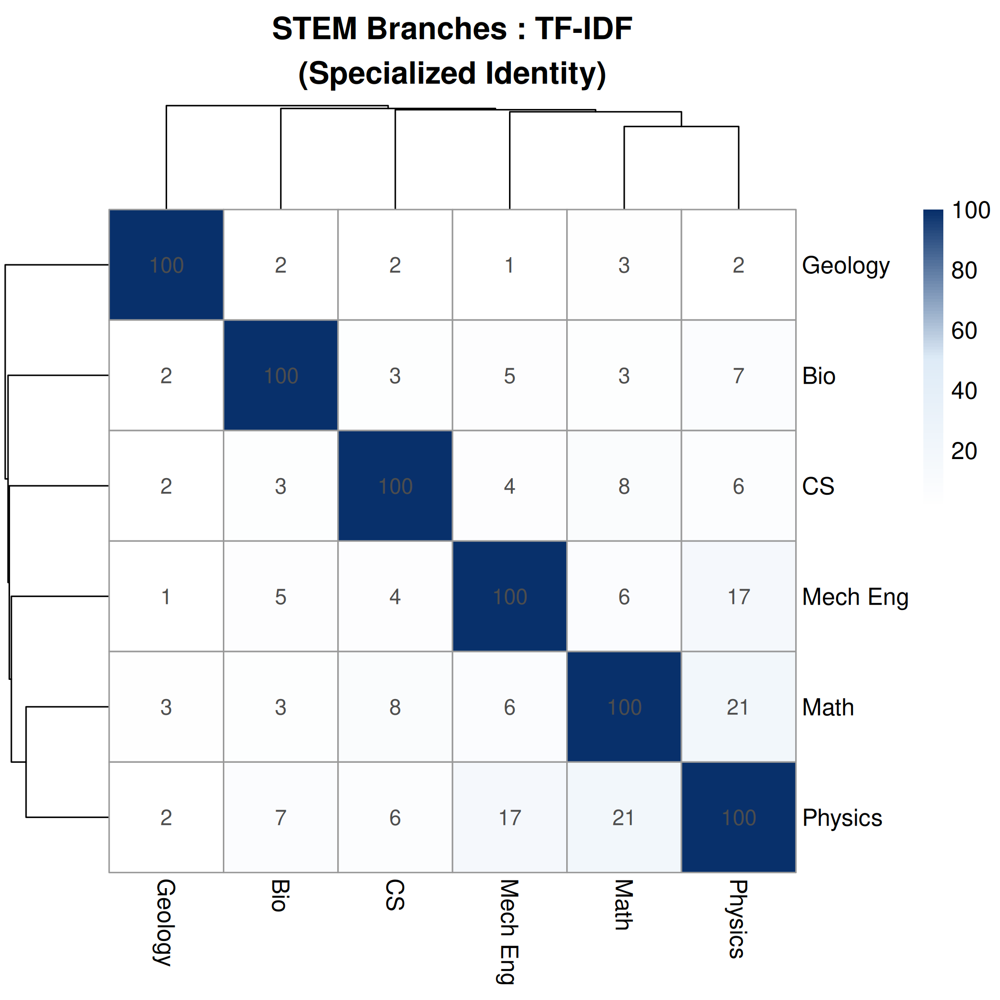
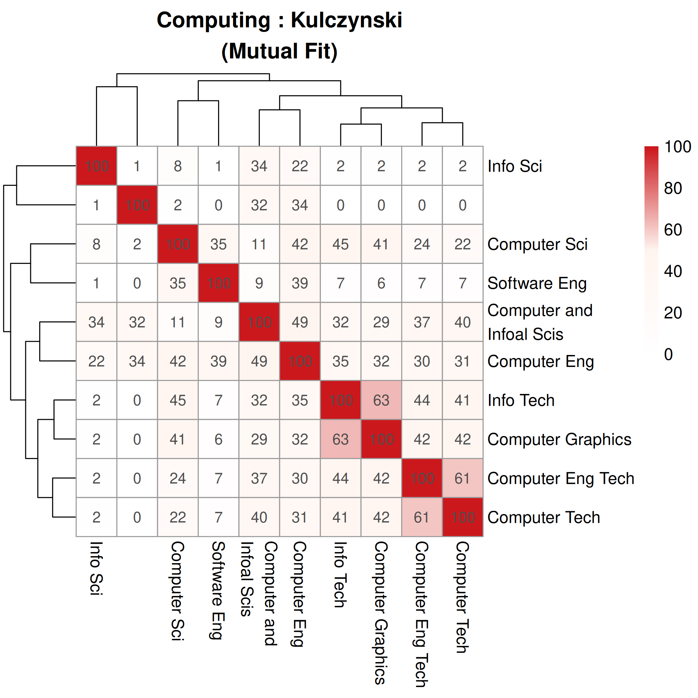

#+title: WIP: Vectorized Interdisciplinary Overlap between STEM Domains using the MIDFIELD Dataset
#+DATE: \today
#+options: toc:nil author:nil

#+LATEX_CLASS: IEEEtran
#+LATEX_CLASS_OPTIONS: [onecolumn]
#+LATEX_HEADER: \usepackage{lipsum} 

#+LATEX_HEADER: \author{
#+LATEX_HEADER:   \IEEEauthorblockN{Jane Doe}
#+LATEX_HEADER:   \IEEEauthorblockA{
#+LATEX_HEADER:     School of Computing \\
#+LATEX_HEADER:     Clemson University \\
#+LATEX_HEADER:     Clemson, SC
#+LATEX_HEADER:   }
#+LATEX_HEADER:   \and
#+LATEX_HEADER:   \IEEEauthorblockN{John Smith}
#+LATEX_HEADER:   \IEEEauthorblockA{
#+LATEX_HEADER:     Department of Engineering \\
#+LATEX_HEADER:     Another University \\
#+LATEX_HEADER:     City, State
#+LATEX_HEADER:   }
#+LATEX_HEADER: }

#+begin_abstract
This work in progress submission outlines advancements in detecting interdisciplinary collaboration in undergraduate STEM student curriculum choices. Students often have a level of agency in the courses they take on their paths to graduation, opting to take courses that may not be housed in their declared major's department. This indicates that the student has knowledge, skills, or attitudes (KSAs) from several disciplines and are interdisciplinary in their education. Courses frequently chosen by students in a given domain indicate a trend that we interpret as overlap between programs. This work highlights engineering and computing programs within the larger STEM context for their histories of interdisciplinarity as well as emerging sub-disciplines (e.g. bioinformatics).

This study aims to inform curriculum design and promote interdisciplinary collaboration both at the student level and the curriculum design level. We use student enrollment in courses as a proxy to determine what fields they invest their efforts into and possibly see as relevant for their immediate career paths or to explore alternative domains before their graduation. This also informs academic advisors about which classes have been and are likely to interest students seeking to explore courses. At the curriculum level, institutions can use this data to facilitate collaboration between known collaborator departments and to identify emerging interdisciplinary fields. Should an institution have a pairing of domains well established at their institution, a high course overlap indicates interest in collaborative curriculum development.
#+end_abstract

#+begin_IEEEkeywords
Curriculum Analysis, MIDFIELD, STEM
#+end_IEEEkeywords

* Reviewer comments :noexport:

This work is quite relevant and timely in STEM education. Moreover, the dataset provides the study's credibility.
The abstract lacks clear research questions, metrics (e.g., indicators and statistics), outcomes, data visualization techniques, and potential implications. Please clarify methods and expected outcomes/benefits.

* Introduction

** Purpose

This work analyzes the robust data set provided by the Multiple-Institution Database for Investigating Engineering Longitudinal Development (MIDFIELD) to identify relationships between STEM degrees, including "parent-child" and "intellectual-cousin" relationships. A shared set of courses completed by students during their paths to graduate indicate an overlap between intellectual domains. This overlap is useful for curriculum designers to understand both how current curriculum design is being accomplished by the students, but also to understand emerging interest from students between domains. By understanding the presence and type of relationship being expressed through student enrollment decisions, departments can better position themselves for interdisciplinary collaboration and institutions can better address national issues requiring and calling for interdisciplinary solutions.

** Study Motivation

** Background

** Need for Convergence

* Methodology

We use the MIDFIELD dataset, which provides a rich record of over 98,000 student course records from eighteen universities in the USA. These paths to graduation are analyzed to determine overlap between courses taken in and out of the students declared major. We have extended this analysis to account for not only presence of course overlap, but also magnitude, enriching the analysis and revealing a higher granularity of interpretation. Data visualization techniques are being developed to present this information in an intuitive manner.

** Data Source

We use the MIDFIELD dataset, which provides a rich record of over 98,000 student course records from eighteen universities in the United States. Data records in MIDFIELD stretch back to the 

** Data Analysis

** Metrics

*** Jaccard Index (Binary Overlap)
The size of the intersection divided by the size of the union.
  \[
  J(A, B) = \frac{|A \cap B|}{|A \cup B|}
  \]
This is the baseline "breadth" metric. In the MIDFIELD dataset, it reflects the total shared curriculum. However, because it treats every course taken by even one student as a set member, it can be easily "diluted" by rare electives, often resulting in lower scores for very large or diverse departments.

*** TF-IDF Cosine (Specific Curricular Bonds)
Weights courses based on their "specificity." A course like /Calculus I/ (taken by many majors) gets low weight, while /Advanced Microcontrollers/ (unique to a few) gets high weight.
  \[
  \text{Cosine Similarity} = \frac{\mathbf{v}_A \cdot \mathbf{v}_B}{\|\mathbf{v}_A\| \|\mathbf{v}_B\|}
  \]
This metric effectively filters out the "STEM background noise." It highlights the specialized technical requirements that truly define a major's identity. It is highly resistant to major size because it uses normalized frequencies.

*** Overlap Coefficient (Subset Detection)
Intersection size divided by the size of the smaller set.
  \[
  \text{Overlap}(A, B) = \frac{|A \cap B|}{\min(|A|, |B|)}
  \]
Excellent for identifying "nested" curricula. For example, if Software Engineering students take almost everything Computer Science students take, but the CS students have a much broader elective set, the Overlap Coefficient will stay high while Jaccard drops. It reveals if one major is effectively a component of another.

*** PMI Similarity (Signature Bonds)
Pointwise Mutual Information measures if a course-major pairing occurs more often than would be expected if they were independent.
  \[
  \text{PMI}(m, c) = \log \left( \frac{p(m, c)}{p(m)p(c)} \right)
  \]
This is the most sensitive metric for "signature" behaviors. It reflects the courses that students are surprised to be in unless they are in that specific major. It is great for distinguishing between two very similar-sounding engineering programs.

*** Max-Scaled Cosine (Internal Core)
Normalizes all course counts relative to the single most popular course within that major.
  \[
  x_{scaled} = \frac{x}{\max(\mathbf{x}_{major})}
  \]
This reflects the "standard experience" of a major. By scaling everything to the major's own "anchor" course, it removes the effect of different graduation rates and focuses purely on the internal structure of what a "typical" student takes.

*** Dice Similarity (Intersection Weighting)
Twice the intersection divided by the sum of the set sizes.
  \[
  \text{Dice}(A, B) = \frac{2 |A \cap B|}{|A| + |B|}
  \]
Similar to Jaccard but gives more credit to the shared courses. It is less sensitive to the total variety of electives (the union) and more focused on the core intersection.

*** Kulczynski Similarity (Mutual Resemblance)
The average of the two inclusion proportions (Intersection/A and Intersection/B).
  \[
  \text{Kulczynski}(A, B) = \frac{1}{2} \left( \frac{|A \cap B|}{|A|} + \frac{|A \cap B|}{|B|} \right)
  \]
Reflects the average confidence that a student from one major would "fit" in the other. It is very robust when comparing a very large major to a small, specialized one.

* Preliminary Results

** STEM Overall

[[file:heatmap_interdisciplinary_top10_jaccard.png]]

** Computing

[[file:heatmap_computing_top10_overlap.png]]

** Engineering

[[file:heatmap_engineering_top10_tfidf.png]]

* Discussion

* Conclusion & Future Directions
