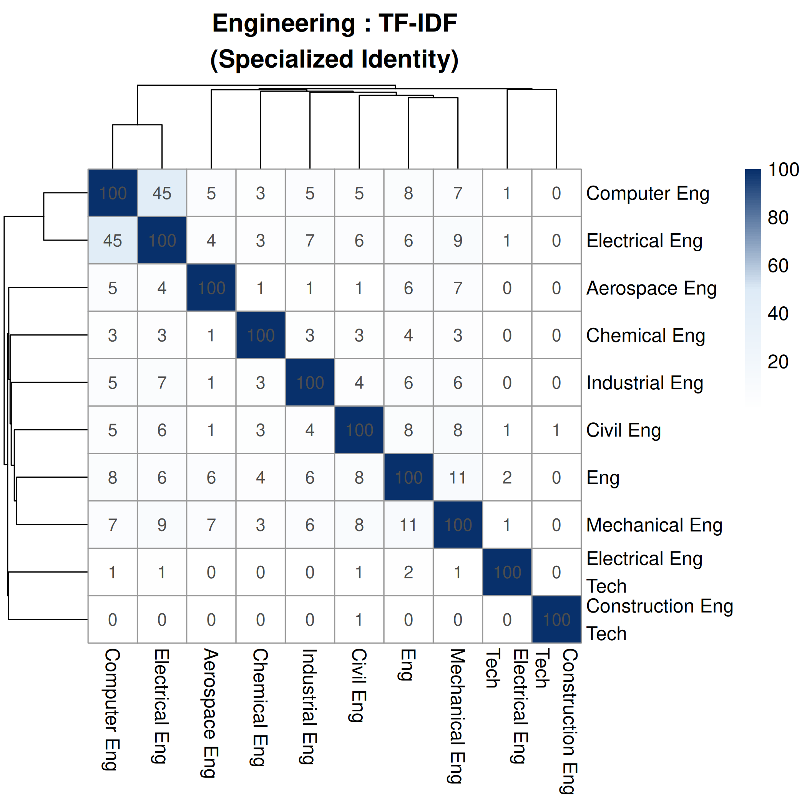
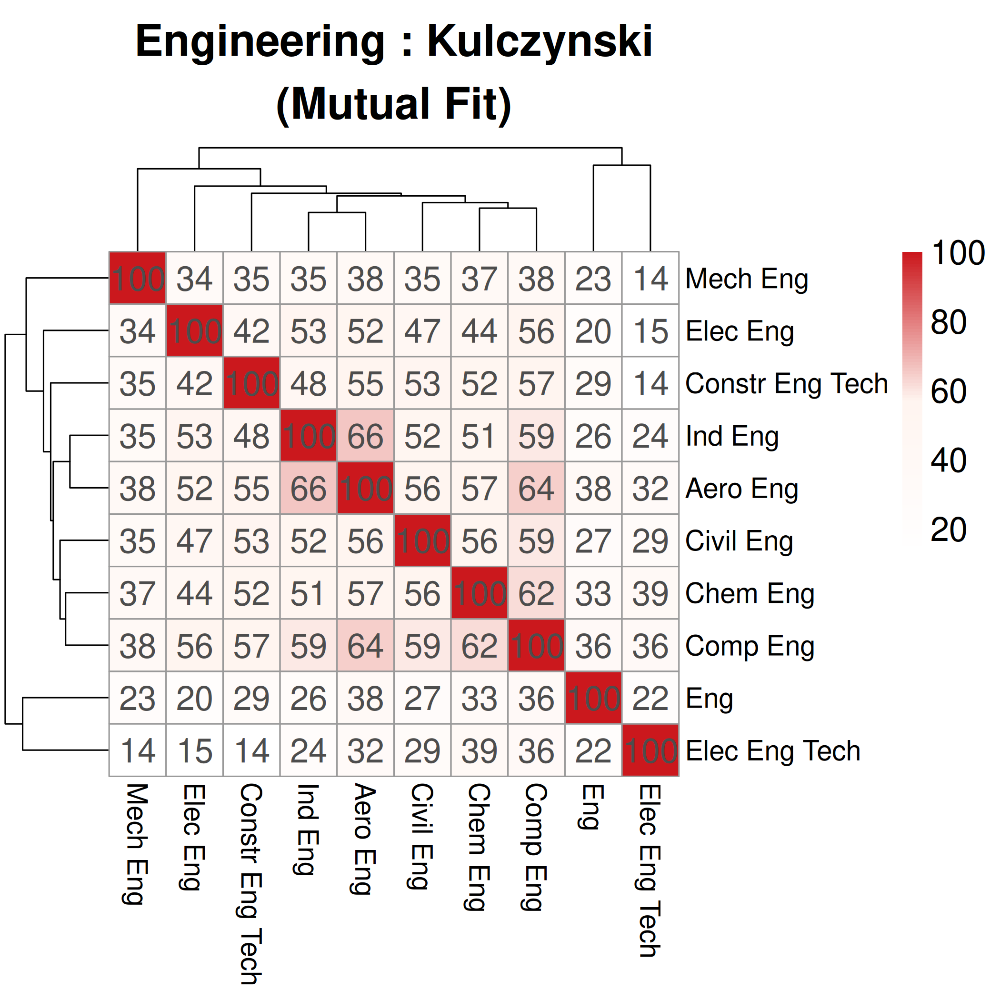
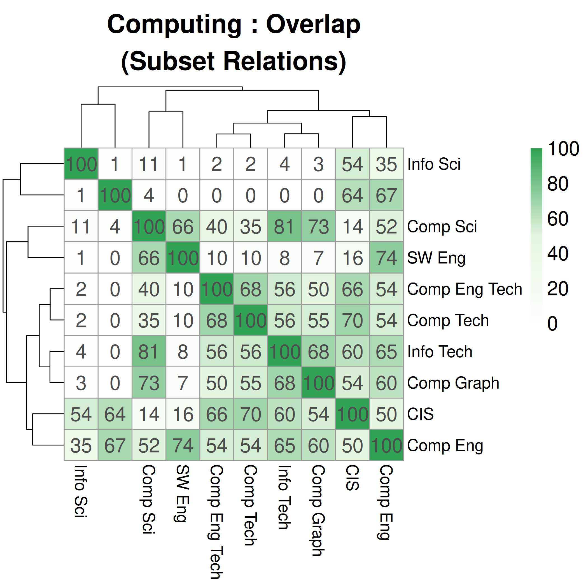
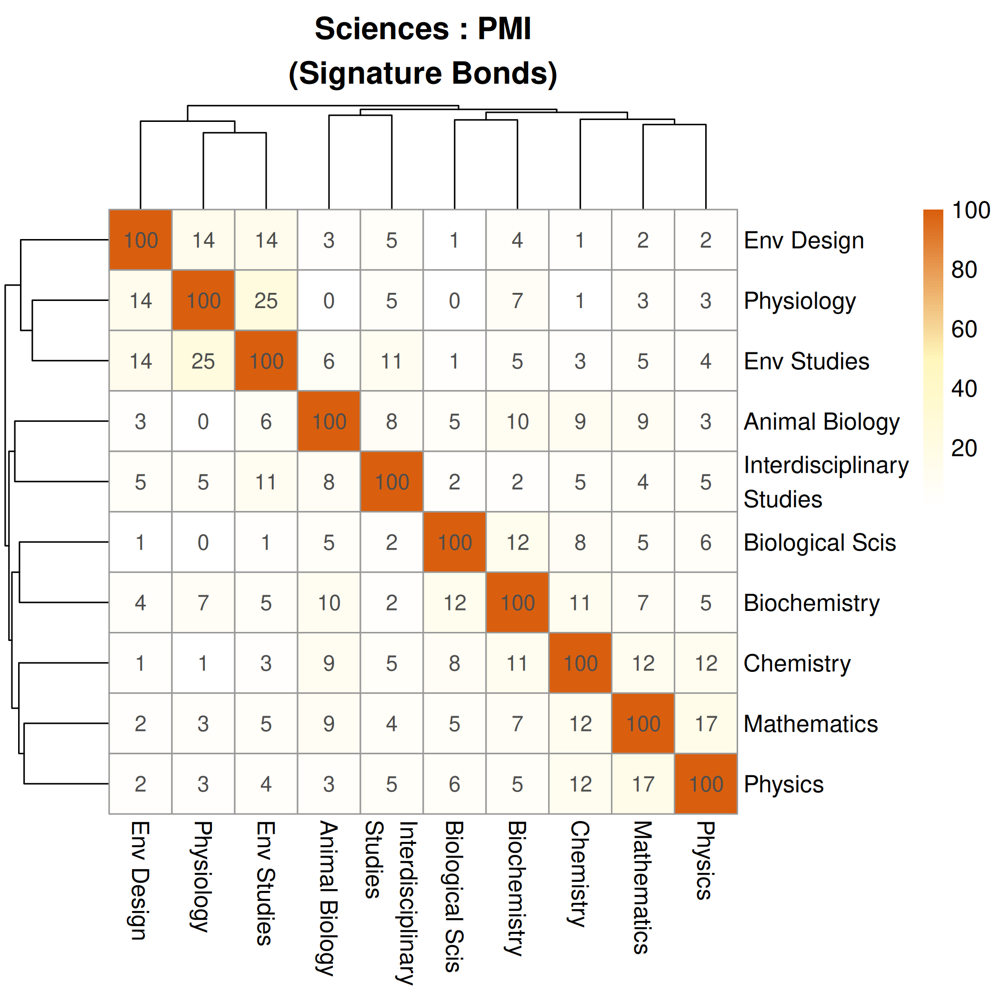
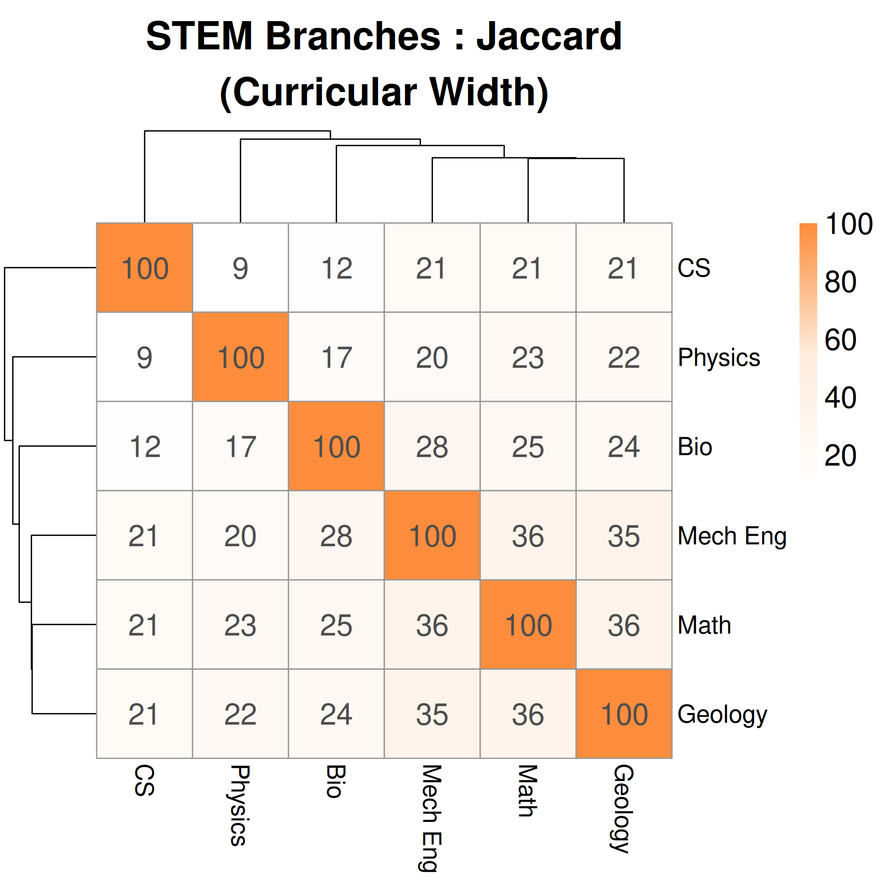

#+title: WIP: Vectorized Interdisciplinary Overlap between STEM Domains using the MIDFIELD Dataset
#+DATE: \today
#+options: toc:nil author:nil

#+LATEX_CLASS: IEEEtran
#+LATEX_CLASS_OPTIONS: [conference, onecolumn, 12pt]
#+LATEX_HEADER: \usepackage{wrapfig}
#+LATEX_HEADER: \usepackage{needspace}
# #+LATEX_HEADER: \setlength{\intextsep}{6pt plus 2pt minus 2pt}
# #+LATEX_HEADER: \setlength{\columnsep}{10pt}

# #+LATEX_HEADER: \author{
# #+LATEX_HEADER:   \IEEEauthorblockN{Dr. Tim Ransom}
# #+LATEX_HEADER:   \IEEEauthorblockA{
# #+LATEX_HEADER:     School of Computing \\
# #+LATEX_HEADER:     Clemson University \\
# #+LATEX_HEADER:     Clemson, SC\\
# #+LATEX_HEADER:   }
# #+LATEX_HEADER:   \and
# #+LATEX_HEADER:   \IEEEauthorblockN{Dr. Stephanie Ashley Damas}
# #+LATEX_HEADER:   \IEEEauthorblockA{
# #+LATEX_HEADER:     Department of Engineering \\
# #+LATEX_HEADER:     Another University \\
# #+LATEX_HEADER:     City, State
# #+LATEX_HEADER:   }
# #+LATEX_HEADER: }

#+begin_abstract
This work in progress submission outlines advancements in detecting interdisciplinary collaboration in undergraduate STEM student curriculum choices using the MIDFIELD dataset. We employ a vectorized approach to analyze student course records, enabling detailed metrics to describe the relationships between domains.

We highlight engineering and computing programs for their histories of interdisciplinarity and emerging sub-disciplines as well as present overall "standard" degrees from major STEM domains. This study aims to inform curriculum design and promote interdisciplinary collaboration both at the student level and the curriculum design level by identifying latent student interests and potential areas for collaborative curriculum development.
#+end_abstract

#+begin_IEEEkeywords
Education; Curriculum Analysis
#+end_IEEEkeywords

* Reviewer comments :noexport:

This work is quite relevant and timely in STEM education. Moreover, the dataset provides the study's credibility.

The abstract lacks clear research questions, metrics (e.g., indicators and statistics), outcomes, data visualization techniques, and potential implications. Please clarify methods and expected outcomes/benefits.

* Introduction

** Study Motivation

Students often have a level of agency in the courses they take on their paths to graduation, opting to take courses that may not be housed in their declared major's department. This indicates that the student has knowledge, skills, or attitudes (KSAs) from several disciplines and are interdisciplinary in their education. Courses frequently chosen by students in a given domain indicate a trend that we interpret as overlap between programs.

Interdisciplinary studies integrate concepts, theories, and methods from multiple disciplines. In interdisciplinary majors, there is a deliberate effort to create a new perspective or approach that is not limited to any single discipline. This results in a deeper understanding of complex issues. Even further, interdisciplinary majors create space for impossible solutions within the confines of a single discipline. While multidisciplinary majors have also been used to collaborate across disciplines, interdisciplinary majors use a combination of tools interchangeable from the distinct disciplines.

Implementing interdisciplinary majors can make STEM programs more attractive to students with marginalized identities who seek to bridge the gap between their lived experiences and computer science fundamentals. As such, this study aims to identify fundamental courses and academic choices that programs can use to facilitate applicability across domains.

This study helps lay the groundwork for promoting interdisciplinary majors between STEM fields. We are interested in the research question: What types of relationships have emerged between undergraduate STEM programs from student enrollment?

** Application Spaces

This work analyzes undergraduate navigation through STEM domains using robust data set provided by the Multiple-Institution Database for Investigating Engineering Longitudinal Development (MIDFIELD). We identify relationships between STEM degrees, including "parent-child" and "intellectual-cousin" relationships, to understand the current interdisciplinary interactions as well as identify emerging and potential interactions. A shared set of courses completed by students during their paths to graduate indicate an overlap between intellectual domains.

We use student enrollment in courses as a proxy to determine what fields they invest their efforts into and possibly see as relevant for their immediate career paths or to explore alternative academic interests. At the student level, this analysis informs academic advisors about which classes are likely to interest students seeking to explore courses. At the department level, these relationships can help curriculum design committees identify where courses may be likely to succeed when hosted in other departments or where additional collaboration may already exist but be undocumented. At a university level, these relationship can be used to build a case for interdisciplinary majors and to identify if existing departments are good candidates to create a new major. If an institution has a pairing of domains well established at their institution, a high course overlap indicates interest in collaborative curriculum development.

Various metrics are used to understand the type of interdisciplinary relationship between domains to help all levels of education accurately understand trends across the MIDFIELD dataset.
# By understanding the presence and type of relationship being expressed through student enrollment decisions, departments can better position themselves for interdisciplinary collaboration and institutions can better address national issues requiring and calling for interdisciplinary solutions.

** Background

Several STEM domains have been historically interdisciplinary. The computing domain has created new interdisciplinary programs as it engages with other knowledge branches such as human centered computing and bioinformatics. These specialized programs offer a targeted approach to solving complex issues and act as a point of attraction for students to enroll in one University or department over another. These interdisciplinary programs' curricula often include courses from their respective "parent" fields. For example, a bioinformatics curriculum can consist of courses from both computer science departments and biology departments. Specialized courses are often also created in the "child" field to meet the needs of interdisciplinary students. Many engineering programs include a general engineering component to their curriculum that give a shared set of KSAs to engineering, creating more of an "intellectual cousin relationship." Overall trends that emerge from considering the relationships between STEM domains as units of analysis can inform several levels of our education system to better support student academic agency and build interdisciplinary collaboration.

** Need for Convergence

Many students matriculate through courses by developing the KSAs that represent their chosen domain. By attaining a degree, students are expected to be prepared to enter the workforce and contribute to solutions to real-world problems using these KSAs. The National Science Foundation has identified several BIG Problems of our generation that require complex solutions guided by contributions from many fields. The NSF proposed growing convergence research as one of the top 10 BIG Ideas to address today's grand challenges. The nation's grand challenges "will not be solved by one discipline alone". They require convergence: merging ideas, approaches and technologies from widely diverse fields of knowledge to stimulate innovation and discovery. To prepare our students to take on the grand challenges, we must evaluate curriculum development to facilitate interdisciplinary studies.

* Methodology

We use the MIDFIELD dataset to collect records of classes that students were enrolled in during their education. Their paths to graduation are analyzed to determine overlap between STEM domains. We have extended this analysis to account for both the presence of course overlap, but also magnitude, enriching the analysis and revealing a higher granularity of interpretation. Data visualization techniques are being developed to present this information in an intuitive manner.

** Data Source

The MIDFIELD dataset provides a rich academic record of over 98,000 student course records from eighteen universities in the USA going back several decades. We filter to data from 2000 onward to address the potential overrepresentation of older degree curricula and to better engage with curricula that are likely to represent a contemporary student's experience.

** Data Analysis

For each CIP code in the MIDFIELD dataset, a set of courses is identified that any student who completed that degree took while progressing toward graduation. These sets include every course students took, including general education courses, courses in and out of their declared major, courses that were begun but not completed, and courses that were required for their graduation and not. This set of courses is then augmented with the frequency of the courses presence in the dataset to create a vector. These vectors represent the domains in a many-dimensional space that enables several metrics which we interpret in the next section. Previous reported analyses relied solely on the binary interpretation of the data, which only enabled Jaccard indices. While useful, this metric (described in the next section) gives us one view into the relationship between domains. Metrics are then used to describe domain similarity, and therefore distance-based clusters and relationships between domains.

** Metric Interpretations within the MIDFIELD dataset

*** Jaccard Index (Binary Overlap)

This is the baseline metric. In the MIDFIELD dataset, it reflects the total shared curriculum. However, because it treats every course taken by even one student as a set member, it can be easily diluted by rare electives, often resulting in lower scores for very large or diverse programs.

$$J(A, B) = \frac{|A \cap B|}{|A \cup B|}$$

*** Term Frequency-Inverse Document Frequency (TF-IDF, Specific Curricular Bonds)

This metric is used to highlight a core of the domain, identifying the specific courses that are both represented within the domain and rare in other domains. We use it to reduce the background noise of very sparsely enrolled courses taken by students. It is highly resistant to major size because it uses normalized frequencies of courses taken. A course like /Calculus I/ (taken by many majors) gets low weight, while /Advanced Microcontrollers/ (unique to a few) gets high weight.

$$\text{Cosine Similarity} = \frac{\mathbf{v}_A \cdot \mathbf{v}_B}{\|\mathbf{v}_A\| \|\mathbf{v}_B\|}$$

*** Overlap Coefficient (Subset Detection)

This metric helps identify "parent-child" relationships between domains. Intersection size divided by the size of the smaller set. For example, if Software Engineering students take almost everything Computer Science students take, but the CS students have a much broader elective set, the Overlap Coefficient will stay high while Jaccard index drops. Majors that are specialized from broader curricula have a high overlap metric.

$$\text{Overlap}(A, B) = \frac{|A \cap B|}{\min(|A|, |B|)}$$

*** PMI Similarity (Signature Bonds)

Pointwise Mutual Information measures if a course-major pairing occurs more often than would be expected if they were independent. This is the most sensitive metric for "signature" behaviors. It shows the courses that students are surprised to be in unless they are in that specific major. We use it to distinguish between highly similar programs.

$$\text{PMI}(m, c) = \log \left( \frac{p(m, c)}{p(m)p(c)} \right)$$

*** Max-Scaled Cosine (Internal Core) :noexport:
Normalizes all course counts relative to the single most popular course within that major.

$$x_{scaled} = \frac{x}{\max(\mathbf{x}_{major})}$$

This reflects the "standard experience" of a major. By scaling everything to the major's own "anchor" course, it removes the effect of different graduation rates and focuses purely on the internal structure of what a "typical" student takes.

*** Dice Similarity (Intersection Weighting) :noexport:
Twice the intersection divided by the sum of the set sizes.

$$\text{Dice}(A, B) = \frac{2 |A \cap B|}{|A| + |B|}$$

Similar to Jaccard but gives more credit to the shared courses. It is less sensitive to the total variety of electives (the union) and more focused on the core intersection.

*** Kulczynski Similarity (Mutual Resemblance)

# Reflects the average confidence that a student from one major would "fit" in the other. It is very robust when comparing a very large major to a small, specialized one.

There is a large imbalance between the representation of the major domains in the data. The large engineering programs have significantly more enrollment data simply because more students have been through those curricula. This metric extends the Jaccard index to be slightly more robust to this issue by considering the average overlap between each set individually.

$$\text{Kulczynski}(A, B) = \frac{1}{2} \left( \frac{|A \cap B|}{|A|} + \frac{|A \cap B|}{|B|} \right)$$

* Preliminary Results

The application of multi-dimensional similarity metrics reveals nuanced relationships between curricula that were previously undetected by the Jaccard indices. By examining the Computing, Engineering, and broader STEM domains, we identify distinct types of curricular overlap. We would like to advise the reader not to ascribe the specific values of the percentage overlaps as the primary point of value in these visualizations. Rather, the relative differences between domains within the same metric and the dendrogram clustering give better insight to the data.

** Engineering

Engineering curricula is a highly applicable space for the term frequence-inverse document frequency because of the high number of shared courses across many domains. Figure 2 shows this TF-IDF metric applied to the engineering majors. While Jaccard indices between engineering disciplines are generally high due to shared mathematics and physics prerequisites (e.g., Electrical Engineering and Computer Engineering share ~33% Jaccard similarity), the TF-IDF metric separates those generic relationships from specific ones. The high TF-IDF similarity between computing and electrical engineering shows that these curricula are closely related even in terms of other engineering programs. This could be caused by the presence of merged "Electrical and Computing Engineering" departments at the sampled universities, but demonstrates the analysis' capability to detect these relationships. This high overlap warrants further investigation into the specific curricular structures of these programs at MIDFIELD institutions.

#+ATTR_LATEX: :width 0.5\columnwidth
#+CAPTION: TF-IDF Similarity in Engineering Degrees
#+LABEL: fig:engineering_heatmap

Notably, the overall TF-IDF similarity between engineering programs is typically very low, around ~7%. This indicates that the specialized classes that these programs distinguish themselves through are not an exceptionally large component of their overall programs, and that the general engineering model of a set base of courses supports the interdisciplinary motivations of this work. In addition to the Jaccard indicies presented in the text, we would also like to present the Kulczynski metric for engineering programs to confirm the TF-IDF metric's ability to pinpoint the most correlated engineering fields (electrical and computer).

#+ATTR_LATEX: :width 0.5\columnwidth
#+CAPTION: TF-IDF Similarity in Engineering Degrees
#+LABEL: fig:engineering_kul

** Computing
In the computing domain (see Figure 1), the multi-metric analysis highlights significant structural differences between related majors. For example, the relationship between Computer Science (CS) and Computer Engineering (CompE) exhibits a moderate Jaccard index (~25%), indicating a notable but not overwhelming overlap in total course load. However, the Overlap Coefficient for this pair spikes to ~52%. This disparity suggests a nested relationship where the core curriculum of one discipline (likely CompE's software requirements) is heavily contained within the other, despite CS having a broader range of electives that dilutes the Jaccard score.

#+ATTR_LATEX: :width 0.5\columnwidth
#+CAPTION: Heatmap of Overlap Coefficients in Computing Degrees
#+LABEL: fig:computing_heatmap

Furthermore, the TF-IDF score for the CS-CompE pair (~29%) remains high relative to other pairings, confirming that the shared courses are not merely general education requirements but are specific, high-value technical courses central to the identity of both majors. In contrast, Information Technology shares a very high overlap (~80% Overlap Coefficient) with CS but a much lower Jaccard score (~8.5%), suggesting that IT curricula may function as a specialized subset of CS with a highly distinct set of non-CS requirements.

** Sciences

The sciences provide an excellent data space to detect when a student decides to take an elective course that is outside of the expected coursework. The immense variation between the science fields contrasts the engineering structure, and so is well represented by the PMI index. In figure, we can see a cluster of related majors between environmental studies and physiology, indicating that these majors are already implementing a higher than typical structure for course collaboration. The high connection between math and physics is expected due to the high amount of double majors in these fields, but their disconnection from the other science branches indicates that these majors are not currently being taken advantage of for collaboration. This implies that these programs are a prime target for the other sciences to seek to build collaboration that is not present in the data.

#+ATTR_LATEX: :width 0.5\columnwidth
#+CAPTION: PMI Similarity in Science Degrees
#+LABEL: fig:science_pmi

** STEM Overall

Broadening the scope to interdisciplinary STEM fields (see Figure 3), Mathematics as expected emerges as a central bridge. The Jaccard index shows Mathematics sharing significant curriculum with Mechanical Engineering (~36%), Physics (~36%), and Computer Science (~21%).

#+ATTR_LATEX: :width 0.5\columnwidth
#+CAPTION: Jaccard Similarity in Interdisciplinary STEM Degrees
#+LABEL: fig:stem_heatmap

Comparing Physics and Engineering, we see that Physics is more curricularly similar to Mechanical Engineering (~20% Jaccard) than to Computer Science (~9% Jaccard). However, the Overlap Coefficient between Physics and Mechanical Engineering (~45%) is notably higher, suggesting that a significant portion of a Physics major's coursework is implicitly required for or taken by Mechanical Engineers, likely in the form of foundational physical science requirements.

* Discussion

The shift from a single similarity metric (Jaccard) to a vectorized approach allows for a significantly more detailed analysis of the relationships between STEM domains. This set of metrics has been selected to account for observed features in the data set. For example, the (perhaps naively) conceptual similarity between computing majors and the general engineering curriculum design trend. 

Overlap Coefficient identifies hierarchical or subset relationships, crucial for understanding if one major is effectively a specialized track of another. TF-IDF acts as a filter for signature courses, revealing if two majors share unique, specialized content or just generic prerequisites. 

PMI highlights "surprising" connections, identifying courses that are statistically unlikely to be taken unless a student is in a specific pair of majors. Applying this to the science curricula identified when students would take a potentially unlikely course in a new domain. This in particular aligns with our work's goal of identifying interdisciplinary collaboration through student enrollment choices.

For curriculum designers, this granularity is vital. A high Jaccard but low TF-IDF score suggests collaboration should focus on standardizing prerequisites (e.g., Calculus sequences). A high TF-IDF score suggests potential for specialized interdisciplinary tracks or certificates (e.g., a dual-major in Aero/Industrial systems).

* Conclusion & Future Directions

This work demonstrates the existing interdisciplinarity collaborations as they are expressed through student agency. In addition to the experts in the field identifying the KSAs that are needed for our big problems, the students themselves can be seen as betting on their futures with their education. By analyzing student enrollment data through various similarity metrics, we are trying to interpret this collective expression of will and use it to better understand how we can support our students on their academic journeys.

Future work will focus on:

Comprehensive interpretation of courses and their contributions to the metrics to supply specific course collaboration recommendations. Applying these metrics across time windows to detect if majors are converging or diverging (e.g., is Biology becoming more computational over time?). Analyzing if these patterns hold across all universities or if specific institutions have unique interdisciplinary characteristics. Developing interactive tools for administrators to explore these vectors dynamically.

* References :noexport:
[1] S. M. Lord et al., "Midfield: A resource for longitudinal student record research," IEEE Transactions on Education, vol. 65, no. 3, pp. 245-256, 2022.

[2] J. T. Klein, Interdisciplinarity: History, theory, and practice. Wayne state university press, 1990.

[3] K. Marquardt, I. Wagner, and L. Happe, "Engaging girls in computer science: Do single-gender interdisciplinary classes help?," in 2023 IEEE/ACM 45th International Conference on Software Engineering.

[4] P. O. Franco et al., "Enhancing undergraduate education and curriculum through an interdisciplinary and quantitative initiative to broaden participation in big data," in Proceedings of the 18th LACCEI International Multi-Conference, 2020.

[5] P. J. Denning and M. Tedre, Computational thinking. MIT Press, 2019.
